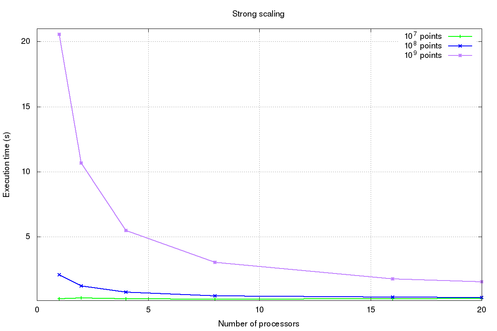

# Computing strong and weak scalability of an HPC application

The goal of the exercise is to test the scalability of the code **pi.c** compared to its parallel version on Ulysses HPC cluster.

The code **pi.c** calculates the value of $\pi$ using Montecarlo integration method: it takes as an argument the number of random points inside the square region circumscribing the unit circle, then estimates the value of $\pi$ in the following way:

\begin{equation}
\pi \approx \frac{\mbox{n. of points inside the circle}}{\mbox{n. of points outside the circle}}.
\end{equation}


The parallel code **mpi_pi.c** is based on MPI communication protocol with MPI\_Send and MPI\_Recv function calls.

## Serial run

The serial code has been run on an increasing number of throws.

***serial_execution.sh***:
```
#!/bin/bash

rm -f serial_times.txt

gcc ../pi.c -o pi.x

N=1000

echo Serial implementation on increasing throws

echo "n. of throws / serial execution time" >> serial_times.txt
echo " " >> serial_times.txt

while  [ $N -le 1000000000 ]; do

	echo -n $N "				" >> serial_times.txt

	/usr/bin/time ./pi.x $N 2>&1 | grep "elap" | awk '{print($3)}'\
			 | awk -F ":" '{print $2}' | awk -F "elapsed" '{print $1}' >>serial_times.txt	
	
	N=$(($N*10))

done

```

We can notice a linearly increasing execution time.


## Strong vs weak scaling

This is the script used for scaling.

***scalability.sh*** :

```
#!/bin/bash

module purge
module load openmpi/1.10.2/gnu/4.8.3 

rm -rf times/*.txt

gcc ../pi.c -o pi.x
mpicc ../mpi_pi.c -o mpi_pi.x

TRIALS=10

for N in 10000000 100000000 1000000000; do

	WEAK_OUT_CLEAN=times/weak_scaling_$N.txt
	STRONG_OUT_CLEAN=times/strong_scaling_$N.txt

	echo $N " iterations"

	#======================================================================
	echo Performing strong scaling

	echo "n. procs / n. pts per proc / avg exec time " >>$STRONG_OUT_CLEAN

	# serial execution
	STRONG_OUT_SER=times/strong_scaling_${N}_1.txt

	echo -n "1				  $N 				" >>$STRONG_OUT_CLEAN

	for i in $(seq 1 $TRIALS); do

		echo -n 1 " " >>$STRONG_OUT_SER
		/usr/bin/time ./pi.x $N 2>&1 | grep "elap" | awk '{print($3)}' \
				| awk -F ":" '{print $2}' | awk -F "elapsed" '{printf $1}' >> $STRONG_OUT_SER
		echo " " >>$STRONG_OUT_SER
	done

	# avg execution time
	cat $STRONG_OUT_SER | awk -F ' ' -v n=$TRIALS '{ sum+=$2; }\
			END{printf ("%.6f ", sum/n)}' >> $STRONG_OUT_CLEAN

	echo " " >> $STRONG_OUT_CLEAN

	# parallel execution
	for procs in 2 4 8 16 20; do  

		STRONG_OUT_PAR=times/strong_scaling_${N}_${procs}.txt

		# number of processors and number of points per proc
		echo -n $procs "				 $(($N/$procs)) 				" >>$STRONG_OUT_CLEAN

		for i in $(seq 1 $TRIALS); do

			echo -n $procs " " >>$STRONG_OUT_PAR
			/usr/bin/time mpirun -np $procs ./mpi_pi.x $(($N/$procs)) 2>&1 | grep "elap" \
						| awk '{print($3)}' | awk -F ":" '{print $2}' | awk -F "elapsed" '{print $1}' \
						>>$STRONG_OUT_PAR
		done

		# avg execution time
		cat $STRONG_OUT_PAR | awk -F ' ' -v n=$TRIALS '{ sum+=$2; }\
				END{printf ("%.6f ", sum/n)}' >> $STRONG_OUT_CLEAN

		echo " " >> $STRONG_OUT_CLEAN
	done

	#======================================================================
	echo Performing weak scaling

	echo "n. procs / n. pts per proc / avg exec time " >>$WEAK_OUT_CLEAN

	# serial execution
	WEAK_OUT_SER=times/weak_scaling_${N}_1.txt

	echo -n "1				  $N 				" >>$WEAK_OUT_CLEAN

	for i in $(seq 1 $TRIALS); do

		echo -n 1 " " >>$WEAK_OUT_SER
		/usr/bin/time ./pi.x $N 2>&1 | grep "elap" | awk '{print($3)}' \
				| awk -F ":" '{print $2}' | awk -F "elapsed" '{printf $1}' >> $WEAK_OUT_SER
		echo " " >>$WEAK_OUT_SER
	done

	# avg execution time
	cat $WEAK_OUT_SER | awk -F ' ' -v n=$TRIALS '{ sum+=$2; }\
			END{printf ("%.6f ", sum/n)}' >> $WEAK_OUT_CLEAN

	echo " " >> $WEAK_OUT_CLEAN

	# parallel execution
	for procs in 2 4 8 16 20; do

		WEAK_OUT_PAR=times/weak_scaling_${N}_${procs}.txt

		# number of processors and number of points per proc
		echo -n $procs "				$N				" >>$WEAK_OUT_CLEAN

		for i in $(seq 1 $TRIALS); do

			echo -n $procs " " >>$WEAK_OUT_PAR
			/usr/bin/time mpirun -np $procs ./mpi_pi.x $N 2>&1 | grep "elap"\
					| awk '{print($3)}' | awk -F ":" '{print $2}' | awk -F "elapsed" '{print $1}'\
					>> $WEAK_OUT_PAR
		done

		# avg execution time
		cat $WEAK_OUT_PAR | awk -F ' ' -v n=$TRIALS '{ sum+=$2; }\
				END{printf ("%f ", sum/n)}' >> $WEAK_OUT_CLEAN

		echo " " >> $WEAK_OUT_CLEAN

	done

	echo " "

done

```

Strong scaling measures execution time for an increasing number of processors and a fixed total problem size. This means that the same amount of computation is performed by more processors and the whole execution time decreases.



A better way of visualizing these results is through a plot of the speedup 
$$ 
speedup(p) = \frac{\mbox{execution_time}(1)}{\mbox{execution_time}(p)}
$$ 
versus the number of processors $p$, since it exihibits the improvement in the speed of execution of the parallel program compared to the serial one. 


Weak scaling measures execution time
in the case in which the number of throws is directly proportional to the number of processors. In this case, all processors perform the same amount of work and execution time is almost constant.


