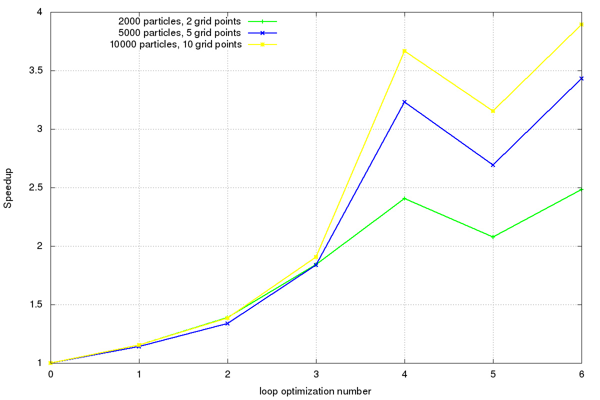
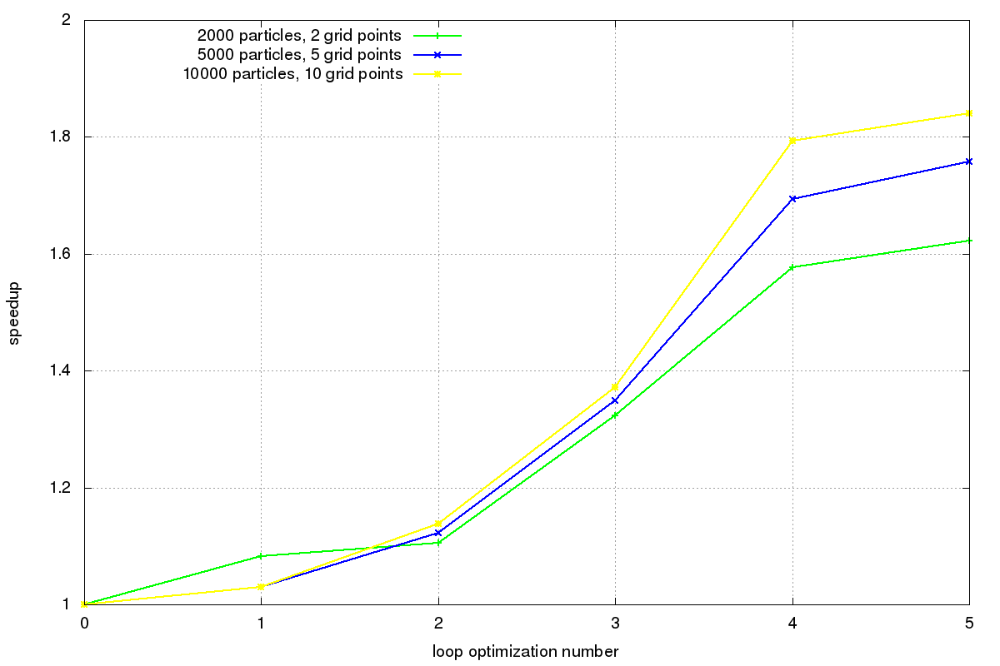
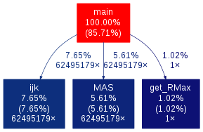
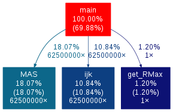

# Loop optimization

The code **avoid_avoidable.c** calculates the distance of some particles from the center of the cells of a grid within a fixed maximum distance. It performs a loop over a certain number of particles, which is optimized in different ways in the other codes provided. 

In the following graph we can see the results in the speedup among 10 trials until 6-th optimization.



* This the initial loop (loop 0):
```
for(p = 0; p < Np; p++)
  for(i = 0; i < Ng; i++)
    for(j = 0; j < Ng; j++)
			for(k = 0; k < Ng; k++)
  {
		dist = sqrt( pow(x[p] - (double)i/Ng + half_size, 2) +
		pow(y[p] - (double)j/Ng + half_size, 2) +
		pow(z[p]  - (double)k/Ng + half_size, 2) );

		if(dist < Rmax)
		  dummy += dist;
	}
```
* In loop 1 instead of calculating the distance, we consider the square distance and check on $Rmax^2$, so we don't have to compute the square root.

```
dist = pow(x[p] - (double)i/Ng + half_size, 2) +
pow(y[p] - (double)j/Ng + half_size, 2) +
pow(z[p]  - (double)k/Ng + half_size, 2);

if(dist < Rmax2)
  dummy += sqrt(dist);
```

* In loop 2 we avoid calling the power function, and insted we just multiply each component.

```
dx = x[p] - (double)i/Ng + half_size;
dy = y[p] - (double)j/Ng + half_size;
dz = z[p] - (double)k/Ng + half_size;

dist = dx*dx + dy*dy + dz*dz;
```

* In loop 3 we avoid diving for Ng and instead we use Ng_inv.

```
double Ng_inv = (double)1.0 / Ng;

double dx2, dy2, dz2;
dx2 = x[p] - (double)i * Ng_inv + half_size; dx2 = dx2*dx2;
dy2 = y[p] - (double)j * Ng_inv + half_size; dy2 = dy2*dy2;
dz2 = z[p] - (double)k * Ng_inv + half_size; dz2 = dz2*dz2;

dist = dx2 + dy2 + dz2;
```

* In code 4 we avoid executing the three loops over each component, and instead we first calculate the distance between x and y components and then its distance from the z component.

```
for(p = 0; p < Np; p++)
  for(i = 0; i < Ng; i++) {
		double dx2 = x[p] - (double)i * Ng_inv + half_size; 
		dx2 = dx2*dx2;
      
		for(j = 0; j < Ng; j++) {
	    double dy = y[p] - (double)j * Ng_inv + half_size;
	    double dist2_xy = dx2 + dy*dy;
	    
	    for(k = 0; k < Ng; k++) {
				double dz;
				dz = z[p] - (double)k * Ng_inv + half_size;
		
				dist = dist2_xy + dz*dz;
		
				if(dist < Rmax2) dummy += sqrt(dist);
      }
	  }
	}
```

* Loop 5 performs multiplications and sums in separate lines of code. In this case, we can notice from the graph that the code obtained is slower than the previous one.

```
for(p = 0; p < Np; p++)
  for(i = 0; i < Ng; i++) {
		double dx2 = x[p] - (double)i * Ng_inv + half_size; 	
		dx2 = dx2*dx2;
      
		for(j = 0; j < Ng; j++) {
	    double dy2 = y[p] - (double)j * Ng_inv + half_size; 
	    dy2 = dy2*dy2;
	    double dist2_xy = dx2 + dy2;
	    
	    for(k = 0; k < Ng; k++) {
				double dz2;
				dz2 = z[p] - (double)k * Ng_inv + half_size; 
				dz2 = dz2*dz2;
		
				dist = dist2_xy + dz2;
		
		if(dist < Rmax2) dummy += sqrt(dist);
	    }
	  }
	}
```

* Loop 6 uses the register keyword in order to suggest to the compiler that the corresponding variables may need a faster access because they are called several times, so it would be useful to keep them in the register. 

```
double register half_size = 0.5 / Ng;
double register Ng_inv = (double)1.0 / Ng;

for (p = 0; p < Np; p++)
    for (i = 0; i < Ng; i++) {
      double dx2 = x[p] - (double)i * Ng_inv + half_size;
      dx2 = dx2 * dx2;

      for (j = 0; j < Ng; j++) {
        double register dy = y[p] - (double)j * Ng_inv + half_size;
        double register dist2_xy = dx2 + dy * dy;

        for (k = 0; k < Ng; k++) {
          double register dz = z[p] - (double)k * Ng_inv + half_size;

          double dist = dist2_xy + dz * dz;

          if (dist < Rmax2) dummy += sqrt(dist);
        }
      }
    }
```

# Distribute Particles

In this example I show the results of five loop optimization techniques applied to the code ***distribute_particles/distribute_v0.c***. The optimizazions chosen are all the above from 1 to 4 and the 6-th one. The following plot shows the speedup using three different input couples.



## Profiling with gprof

In this case I profiled ***distribute_particles.c*** in versions **v0** and **v5**, using *500* particles and *50* gridpoints, in order to compare their function calls:
```
$ gcc -g -pg ../distribute_v0.c -o distribute_v0_gprof.x -lm
$ ./distribute_v0_gprof.x 500 50 0
$ gprof ./distribute_v0_gprof.x | gprof2dot | dot -T png -o call_graph_v0.png
$ gcc -g -pg ../distribute_v0.c -o distribute_v0_gprof.x -lm
$ ./distribute_v5_gprof.x 500 50 0
$ gprof ./distribute_v5_gprof.x | gprof2dot | dot -T png -o call_graph_v5.png
```


| |  |
|:--:|:--:|
| *distribute_v0.c* | *distribute_v5.c* |

These call graphs show how much time has been spent by the program in each function. Functions *ijk*, *MAS* and *getRMax* are equal in both codes, but we can notice that version *5* spent a lower percentage of time inside the main, due to loop optimizations. 