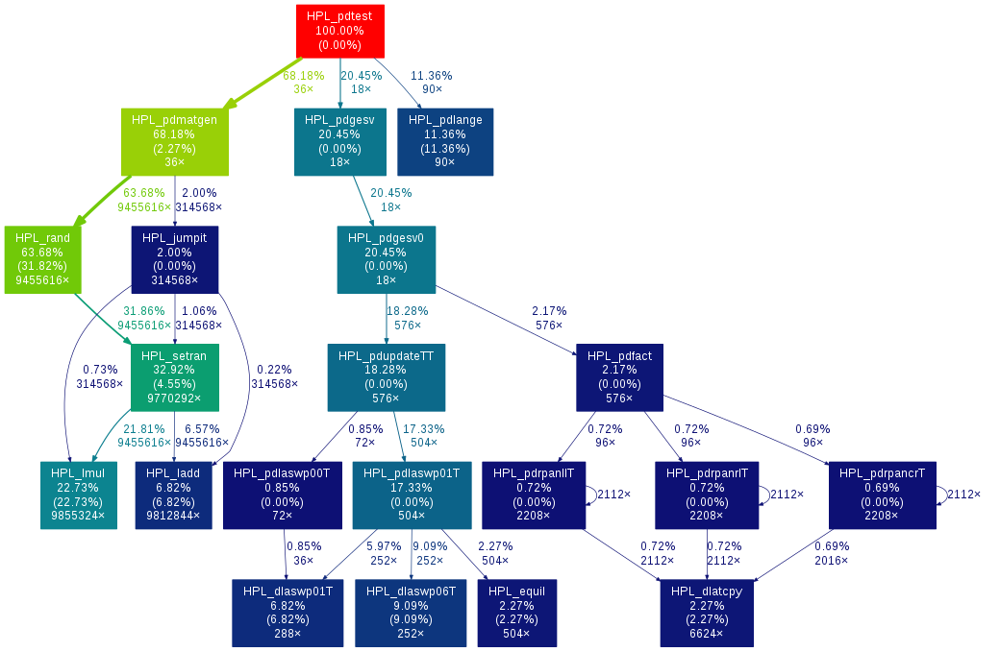

# Profiling HPL with gprof

A profiler is a tool used to know the amount of time a program spends during each function call. I profiled HPL benchmark using *gprof* profiler, which allows to create a nice graph displaying all function calls and the percentage of time spent in the subroutines of each one of them.

The profiling has been done on my laptop, having two `Intel(R) Core(TM) i7-7500U CPU @ 2.70GHz` double-core processors.

First of all I created a new makefile ***Make.hpl_gprof*** as follows:
```
$ diff setup/Make.Linux_PII_CBLAS  Make.hpl_gprof
< ARCH         = Linux_PII_CBLAS
---
> ARCH         = hpl_gprof
70c70
< TOPdir       = $(HOME)/hpl
---
> TOPdir       = /home/ginevracoal/Downloads/hpl-2.2
84,86c84,86
< MPdir        = /usr/local/mpi
< MPinc        = -I$(MPdir)/include
< MPlib        = $(MPdir)/lib/libmpich.a
---
> #MPdir        = /usr/local/mpi
> #MPinc        = -I$(MPdir)/include
> #MPlib        = $(MPdir)/lib/libmpich.a
95c95
< LAdir        = $(HOME)/netlib/ARCHIVES/Linux_PII
---
> LAdir        = /usr/lib
97c97
< LAlib        = $(LAdir)/libcblas.a $(LAdir)/libatlas.a
---
> LAlib        = $(LAdir)/libblas.so
169c169
< CC           = /usr/bin/gcc
---
> CC           = /usr/bin/mpicc
171c171
< CCFLAGS      = $(HPL_DEFS) -fomit-frame-pointer -O3 -funroll-loops
---
> CCFLAGS      = $(HPL_DEFS) -O3 -g -pg
176c176
< LINKER       = /usr/bin/g77
---
> LINKER       = /usr/bin/mpif90

```

Then I ran the commands:
```
$ make arch=hpl_gprof
$ cd bin/hpl_gprof
$ gprof mpirun -np 4 xhpl | gprof2dot | dot -T png -o call_graph.png
```

using parameters 
```
N      :    1024 
NB     :      32 
PMAP   : Row-major process mapping
P      :       2 
Q      :       2
```
in the ***HPL.dat*** file.

||
|:-:|
|HPL call graph|


