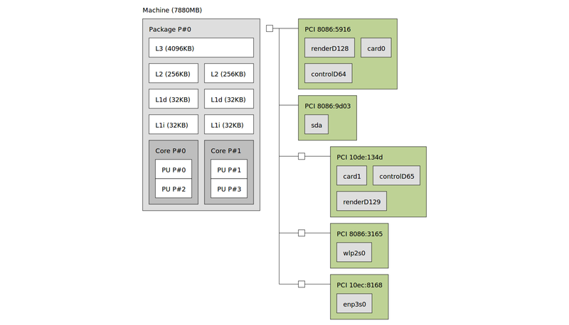
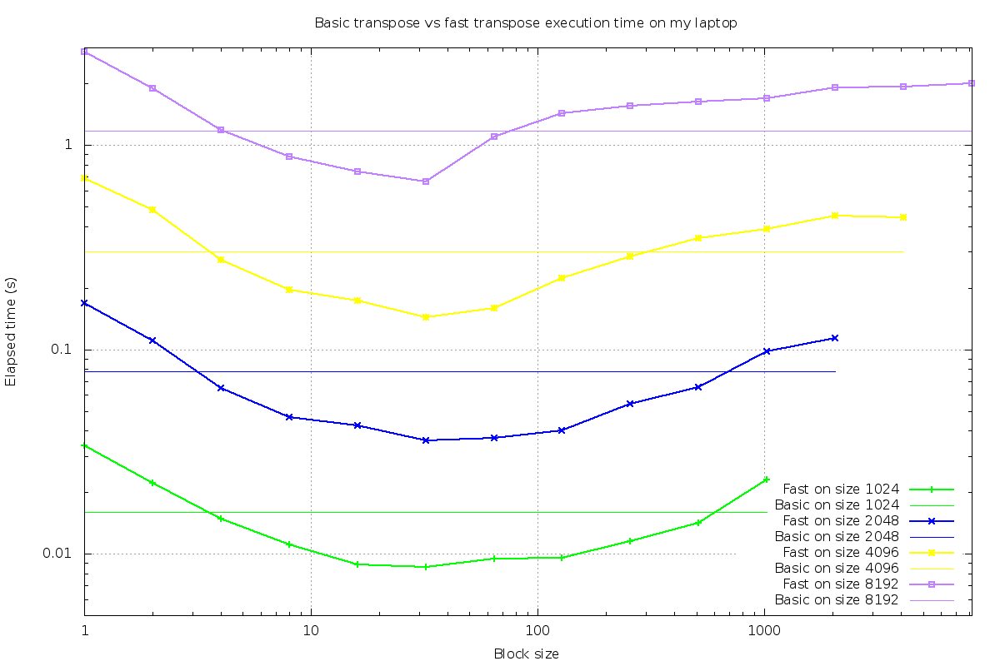
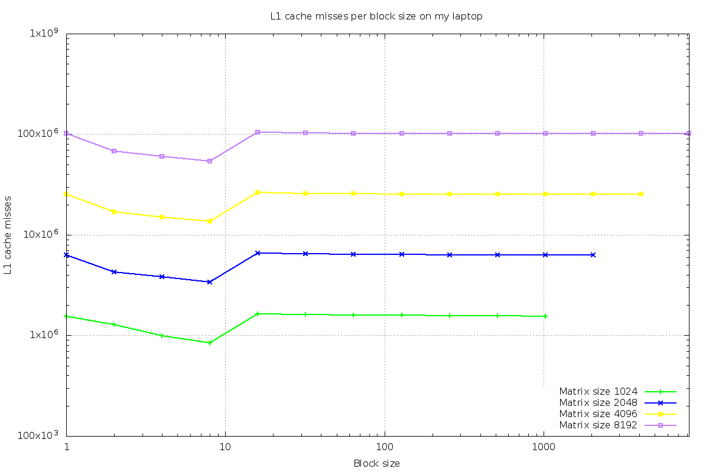
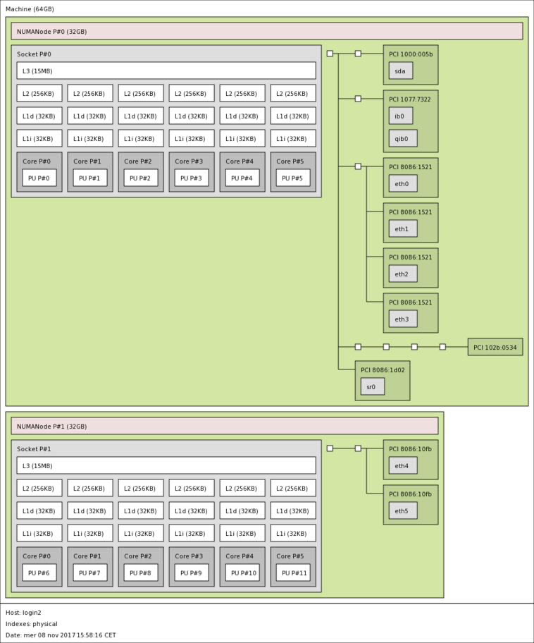
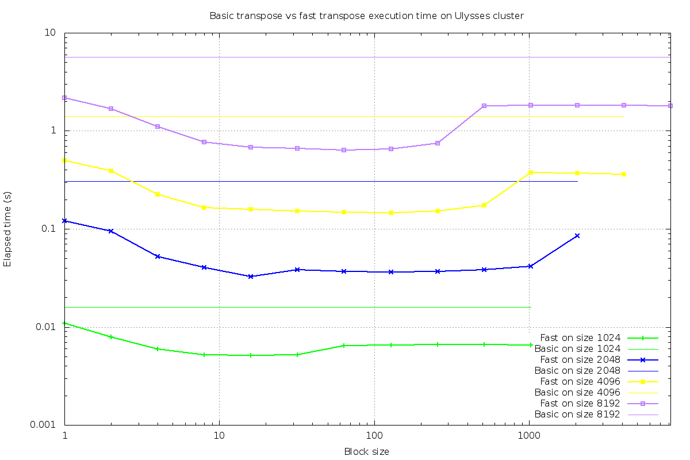

# Optimization of transpose algorithm

## Fast implementation of the algorithm
The optimized version **faster_transpose.c** of the Fast Transpose algorithm decomposes the given matrix into sub blocks, calculates the transpose of each block using the basic algorithm implementation and swaps two symmetrically corresponding blocks inside the matrix.
Matrix size has to be a multiple of block size. 

***faster_transpose.c***:
```
int n_blocks = MATRIXSIZE / BLOCKSIZE; 

	int h_A, k_A;

	t_start=cclock();

/*	running on all the blocks*/
	for(int h = 0; h < n_blocks; h++){
		for(int k = 0; k < n_blocks; k++){

			h_A = h * BLOCKSIZE;
			k_A = k * BLOCKSIZE;

/*	calculating the transpose */
			for (i=0; i < BLOCKSIZE; i++){
				for (j=0; j < BLOCKSIZE; j++){
					AT[ ((i+h_A) * MATRIXSIZE) + (j+k_A)] = A[ (j+k_A)*MATRIXSIZE + (i+h_A)];

				}
			}

		}
```


I also included a previous optimization of the basic algorithm, which uses two ausiliary matrices to store each block and the corresponding transpose.

***fast_transpose.c***:
```
int n_blocks = MATRIXSIZE / BLOCKSIZE; 
	double * B = ( double * ) malloc ( BLOCKDIM * sizeof( double ) );
	double * BT = ( double * ) malloc ( BLOCKDIM * sizeof( double ) );

	int h_B, k_B;

	t_start=cclock();

/*	running on all the blocks*/
	for(int h = 0; h < n_blocks; h++){
		for(int k = 0; k < n_blocks; k++){

			h_B = h * BLOCKSIZE;
			k_B = k * BLOCKSIZE;

/*B is the (h,k) block of A*/
			for (i=0; i < BLOCKSIZE; i++){
				for (j=0; j < BLOCKSIZE; j++){
					B[ (i * BLOCKSIZE) + j ] = A[ ((i+h_B) * MATRIXSIZE) + (j+k_B) ];
				}
			}

			//transpose(B, BT, BLOCKSIZE);
			for(int i=0; i<BLOCKSIZE; i++){
					for(int j=0; j<BLOCKSIZE; j++)
						BT[ (j*BLOCKSIZE) + i ] = B[ (i*BLOCKSIZE) + j ];
				}
			
/*	BT is the (k,h) block of AT*/
			for (i=0; i < BLOCKSIZE; i++){
				for (j=0; j < BLOCKSIZE; j++){
					AT[ ((i+k_B) * MATRIXSIZE) + (j+h_B)] = BT[ i*BLOCKSIZE + j];
				}
			}

		}
	}

```

## Testing the performances
Let's compare the execution time (s) of basic and fast implementations. In the second case, time varies depending on the size of sub blocks. 

First I ran the two codes on my laptop, which has the following specifications:


The following plot shows how the two codes behave on matrices of four different sizes: 1024, 2048, 4096, 8192.



The code ***faster_transpose.c*** has been run with an increasing block size on 10 trials, calculating the average execution time on trials. For each possible dimension of the matrix there is an optimal size of blocks for the execution of the fast transpose. Moreover, we can notice that for a small number of blocks the execution is slower, because of the four nested loops. 

## L1 cache misses

In this section perf profiler has been used to plot the number of L1 cache misses vs the block size, using the command:
`perf stat -e  L1-dcache-load-misses ./faster_transpose.x $MATRIXSIZE $BLOCKSIZE`.
The number of misses indicates how often a given item of data was referenced but not found in the L1 cache memory.




## Performances on Ulysses cluster
The same analysis has been done using Ulysses cluster, with the following specifications:



The behaviour is similar to the previous one.




