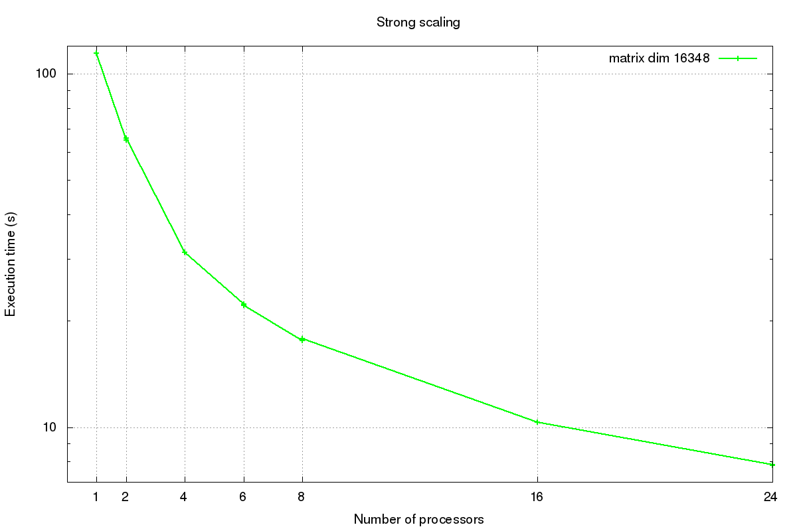
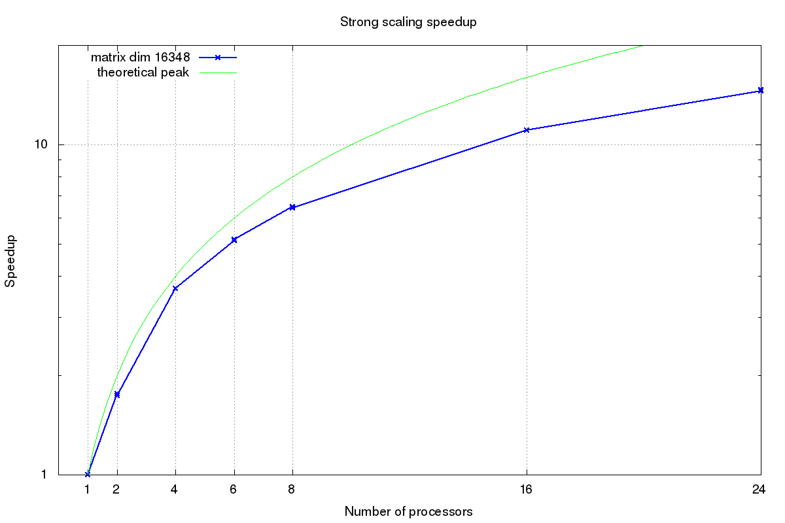

# HPL benchmark using MKL library

It this exercise I tested HPL benchmark on Cosilt cluster, using MKL multithread library from Intel, which allows to optimize math routines. The goal was to find the best parameters in order to improve HPL performances and to get as close as possible to the theoretical peak performance, defined as

$$theoretical peak performance [Gflop/s] = (CPU speed [GHz]) x (# of cores/CPU) x (# of flops/cycle) x (# of CPUs/node).$$


The code has been run on one node of Cosilt cluster, using two sockets with processors `Intel(R) Xeon(R) CPU E5-2697 v2 @ 2.70GHz` and 12 cores each. The associated theoretical peak performance is 

$$
(2.7GHz) x (12 cores/CPU) x (8 flops/cycle) x (2 CPUs/node) = 518.4 Gflop/s.
$$


## Setup

In the top level directory I created ***Make.gin***, by setting the suitable compilers, libraries and paths:

```
#  
#  -- High Performance Computing Linpack Benchmark (HPL)                
#     HPL - 2.2 - February 24, 2016                          
#     Antoine P. Petitet                                                
#     University of Tennessee, Knoxville                                
#     Innovative Computing Laboratory                                 
#     (C) Copyright 2000-2008 All Rights Reserved                       
#                                               

...

# ----------------------------------------------------------------------
# - shell --------------------------------------------------------------
# ----------------------------------------------------------------------
#
SHELL        = /bin/sh
#
CD           = cd
CP           = cp
LN_S         = ln -s
MKDIR        = mkdir
RM           = /bin/rm -f
TOUCH        = touch
#
# ----------------------------------------------------------------------
# - Platform identifier ------------------------------------------------
# ----------------------------------------------------------------------
#
ARCH         = gin
#
# ----------------------------------------------------------------------
# - HPL Directory Structure / HPL library ------------------------------
# ----------------------------------------------------------------------
#
TOPdir       = /u/DSSC17/gcarbone/hpl-2.2
INCdir       = $(TOPdir)/include
BINdir       = $(TOPdir)/bin/$(ARCH)
LIBdir       = $(TOPdir)/lib/$(ARCH)
#
HPLlib       = $(LIBdir)/libhpl.a 
#
# ----------------------------------------------------------------------
# - Message Passing library (MPI) --------------------------------------
# ----------------------------------------------------------------------
# MPinc tells the  C  compiler where to find the Message Passing library
# header files,  MPlib  is defined  to be the name of  the library to be
# used. The variable MPdir is only used for defining MPinc and MPlib.
#
#MPdir        =
#MPinc        =
#MPlib        =
#
# ----------------------------------------------------------------------
# - Linear Algebra library (BLAS or VSIPL) -----------------------------
# ----------------------------------------------------------------------
# LAinc tells the  C  compiler where to find the Linear Algebra  library
# header files,  LAlib  is defined  to be the name of  the library to be
# used. The variable LAdir is only used for defining LAinc and LAlib.
#
LAdir        = #$(HOME)/netlib/ARCHIVES/Linux_PII
LAinc        =
LAlib        = #$(LAdir)/libcblas.a $(LAdir)/libatlas.a
MKLROOT       = /opt/cluster/intel/mkl/
#
# ----------------------------------------------------------------------
# - F77 / C interface --------------------------------------------------
# ----------------------------------------------------------------------
# You can skip this section  if and only if  you are not planning to use
# a  BLAS  library featuring a Fortran 77 interface.  Otherwise,  it  is
# necessary  to  fill out the  F2CDEFS  variable  with  the  appropriate
# options.  **One and only one**  option should be chosen in **each** of
# the 3 following categories:
#
# 1) name space (How C calls a Fortran 77 routine)
#
# -DAdd_              : all lower case and a suffixed underscore  (Suns,
#                       Intel, ...),                           [default]
# -DNoChange          : all lower case (IBM RS6000),
# -DUpCase            : all upper case (Cray),
# -DAdd__             : the FORTRAN compiler in use is f2c.
#
# 2) C and Fortran 77 integer mapping
#
# -DF77_INTEGER=int   : Fortran 77 INTEGER is a C int,         [default]
# -DF77_INTEGER=long  : Fortran 77 INTEGER is a C long,
# -DF77_INTEGER=short : Fortran 77 INTEGER is a C short.
#
# 3) Fortran 77 string handling
#
# -DStringSunStyle    : The string address is passed at the string loca-
#                       tion on the stack, and the string length is then
#                       passed as  an  F77_INTEGER  after  all  explicit
#                       stack arguments,                       [default]
# -DStringStructPtr   : The address  of  a  structure  is  passed  by  a
#                       Fortran 77  string,  and the structure is of the
#                       form: struct {char *cp; F77_INTEGER len;},
# -DStringStructVal   : A structure is passed by value for each  Fortran
#                       77 string,  and  the  structure is  of the form:
#                       struct {char *cp; F77_INTEGER len;},
# -DStringCrayStyle   : Special option for  Cray  machines,  which  uses
#                       Cray  fcd  (fortran  character  descriptor)  for
#                       interoperation.
#
F2CDEFS      =
#
# ----------------------------------------------------------------------
# - HPL includes / libraries / specifics -------------------------------
# ----------------------------------------------------------------------
#
HPL_INCLUDES = -I$(INCdir) -I$(INCdir)/$(ARCH) $(LAinc) $(MPinc)
HPL_LIBS     = $(HPLlib) $(LAlib) $(MPlib)
#
# - Compile time options -----------------------------------------------
#
# -DHPL_COPY_L           force the copy of the panel L before bcast;
# -DHPL_CALL_CBLAS       call the cblas interface;
# -DHPL_CALL_VSIPL       call the vsip  library;
# -DHPL_DETAILED_TIMING  enable detailed timers;
#
# By default HPL will:
#    *) not copy L before broadcast,
#    *) call the BLAS Fortran 77 interface,
#    *) not display detailed timing information.
#
HPL_OPTS     = -DHPL_CALL_CBLAS
#
# ----------------------------------------------------------------------
#
HPL_DEFS     = $(F2CDEFS) $(HPL_OPTS) $(HPL_INCLUDES)
#
# ----------------------------------------------------------------------
# - Compilers / linkers - Optimization flags ---------------------------
# ----------------------------------------------------------------------
#
CC           = /opt/cluster/openmpi/1.10.2/gnu/4.8.3/bin/mpicc #mpicc
CCNOOPT      = $(HPL_DEFS)
CCFLAGS      = $(HPL_DEFS) -fomit-frame-pointer -O3 -funroll-loops -W -Wall -m64 -I${MKLROOT}/include
#
# On some platforms,  it is necessary  to use the Fortran linker to find
# the Fortran internals used in the BLAS library.
#
LINKER       = /opt/cluster/openmpi/1.10.2/gnu/4.8.3/bin/mpif77
LINKFLAGS    = $(CCFLAGS) -L${MKLROOT}/lib/intel64 -Wl,--no-as-needed -lmkl_intel_lp64 -lmkl_gnu_thread -lmkl_core -lgomp -lpthread -lm -ldl
#
ARCHIVER     = ar
ARFLAGS      = r
RANLIB       = echo
#
# ----------------------------------------------------------------------
```

## Tuning

The ***HPL.dat*** file in `bin/gin` folder contains all the informations about the problem size, the machine configuration and the algorithm itself. The parameters you can change in order do tune HPL with MKL are:
* the size of the matrix **N**
* the number of blocks **Nb**
* the size of blocks **PsxQs**.

After loading modules 
```
gnu/4.8.3
openmpi/1.10.2/gnu/4.8.3
mkl/intel
```
and running some tests with the command `OMP_NUM_THREADS=1 mpirun -np 24 xhpl`, I got the best results using the following parameters:
```
N      :   65536 
NB     :     256 
PMAP   : Row-major process mapping
P      :       4 
Q      :       6 
```
and achieved 88% of theoretical peak performance with $455.3 Gflop/s$.

## Strong scaling

In the following graphs I am showing execution time and strong scaling results using matrix size $N=16348$, number of blocks $NB=128$ and an increasing number of processors.


 


