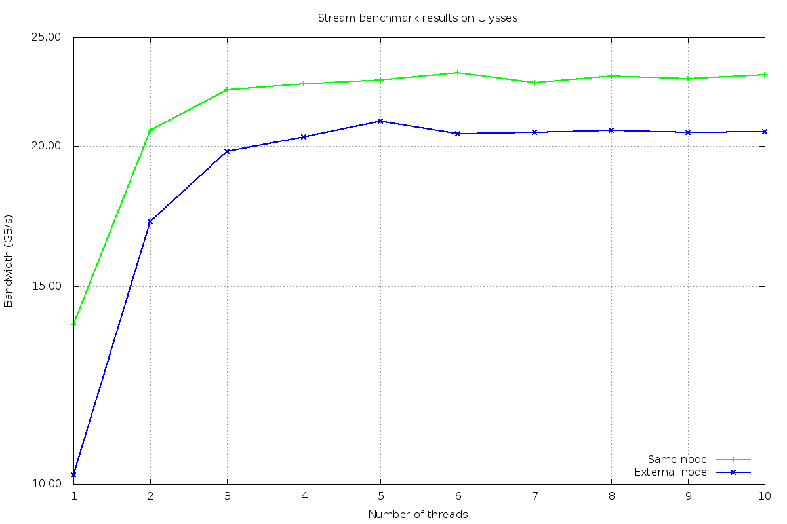

# Latency and bandwidth estimates

## Stream benchmark
*Stream* is a benchmark program that measures memory bandwidth in MB/s. Here I am testing Ulysses cluster on two NUMA nodes (placed in two different sockets) with 10 cores each. 
`numactl --hardware` gives:

```
available: 2 nodes (0-1)
node 0 cpus: 0 1 2 3 4 5 6 7 8 9
node 0 size: 20451 MB
node 0 free: 19534 MB
node 1 cpus: 10 11 12 13 14 15 16 17 18 19
node 1 size: 20480 MB
node 1 free: 19599 MB
node distances:
node   0   1 
  0:  10  11 
  1:  11  10 
```

In order to run the benchmark with memory placement specifications I use `numactl` command and the following options:
* `--membind` to allocate memory only from specific nodes;
* `--cpunodebind` to execute command on the CPUs of specific nodes.

### Bandwidth of a single core
Here I am calculating the bandwidth for memory access of one core to its memory in the same socket.

`OMP_NUM_THREADS=1 numactl --cpunodebind 0 --membind 0 ./stream_omp.x | grep "Triad:" | awk '{print $2}'
`

gives 14038.3 MB/s.

In order to make one core access the memory from the other socket I use the command

`OMP_NUM_THREADS=1 numactl --cpunodebind 0 --membind 1 ./stream_omp.x | grep "Triad:" | awk '{print $2}'
`

The output is 10322.3 MB/s.

### Increasing the number of threads

The maximum numer of threads per core is set to 10, since Ulysses does not support multi-threading.

`(for i in seq 1 10; do OMP_NUM_THREADS=$i numactl --cpunodebind 0 --membind 0 ./stream_omp.x; done) | grep "Triad:" | awk '{print $2}'`
calculates the badwidth of one single core reading from memory in the same socket, using an increasing number of threads.

Then I run the same command and force the access to memory in the other socket
`(for i in seq 1 10; do OMP_NUM_THREADS=$i numactl --cpunodebind 0 --membind 1 ./stream_omp.x; done) | grep "Triad:" | awk '{print $2}'`

The results are stored in *stream.txt*:


|number of threads    |socket 0 bandwidth (MB/s)|socket 1 bandwidth (MB/s)|
|:--------:|:----------:|:-------------:|
|		1 			|	13875.2			|	10187.3|
|		2 			|	20670.1			|	17149.0|
|		3 			|	22458.5			|	19797.9|
|		4 			|	22711.7			|	20368.6|
|		5 			|	22914.7			|	21061.1|
|		6 			|	23236.9			|	20514.2|
|		7 			|	22772.1			|	20585.6|
|		8 			|	23080.3			|	20647.4|
|		9 			|	22960.7			|	20568.2|
|		10 			|	23155.2			|	20598.2|





## Latency with MPI

In this exercise I run MPI *ping-pong benchmark* among to processors within the same node, in order to estimate their latency, a measure for delay, and bandwidth, a measure for capacity. This benchmark is based on the use of message passing functions MPI_Send and MPI_Recv to bounce messages back and forth, and it is meant to be used using exactly two processes.

### Intrasocket

For intrasocket analysis I simply chose two processes on core 0 and core 7, which are contained into the same node.
```
$ module load impi-trial/5.0.1.035 
$ cd /u/shared/programs/x86_64/intel/impi_5.0.1/bin64
$ mpirun -np 2 hwloc-bind core:0 core:7 ./IMB-MPI1 PingPong
```

The output
```
#---------------------------------------------------
# Benchmarking PingPong 
# #processes = 2 
#---------------------------------------------------
       #bytes #repetitions      t[usec]   Mbytes/sec
            0         1000         0.19         0.00
            1         1000         0.19         4.94
            2         1000         0.20         9.69
            4         1000         0.19        20.51
            8         1000         0.19        39.83
           16         1000         0.19        82.05
           32         1000         0.22       136.24
           64         1000         0.27       229.39
          128         1000         0.28       431.34
          256         1000         0.33       743.38
          512         1000         0.38      1290.08
         1024         1000         0.43      2283.80
         2048         1000         0.55      3544.79
         4096         1000         0.83      4720.93
         8192         1000         1.42      5496.14
        16384         1000         2.57      6079.69
        32768         1000         4.55      6865.10
        65536          640         7.61      8213.66
       131072          320        14.20      8805.78
       262144          160        26.84      9315.24
       524288           80        49.65     10070.36
      1048576           40        94.65     10565.33
      2097152           20       180.90     11055.83
      4194304           10       351.14     11391.37

```
gave an estimated latency of $0.20 \mu s$ and maximum bandwidth of $11.19 GB/s$.

### Intersocket
For the intersocket analysis I considered two processes on core 0 an 15, placed in two different sockets.

```
$ mpirun -np 2 hwloc-bind core:0 core:15 ./IMB-MPI1 PingPong
...

#---------------------------------------------------
# Benchmarking PingPong 
# #processes = 2 
#---------------------------------------------------
       #bytes #repetitions      t[usec]   Mbytes/sec
            0         1000         0.49         0.00
            1         1000         0.51         1.86
            2         1000         0.55         3.49
            4         1000         0.52         7.36
            8         1000         0.51        14.92
           16         1000         0.52        29.20
           32         1000         0.55        55.23
           64         1000         0.56       108.61
          128         1000         0.59       207.96
          256         1000         0.61       401.57
          512         1000         0.81       605.02
         1024         1000         0.99       986.39
         2048         1000         1.30      1504.78
         4096         1000         1.85      2116.11
         8192         1000         3.31      2357.07
        16384         1000         5.49      2844.01
        32768         1000        10.48      2982.87
        65536          640        12.67      4931.86
       131072          320        22.74      5496.40
       262144          160        42.02      5950.11
       524288           80        86.96      5749.66
      1048576           40       178.83      5591.75
      2097152           20       362.28      5520.64
      4194304           10       731.65      5467.12

```

In this case the estimated latency is $0.52 \mu s$, while maximum bandwidth is $5.46 GB/s$.