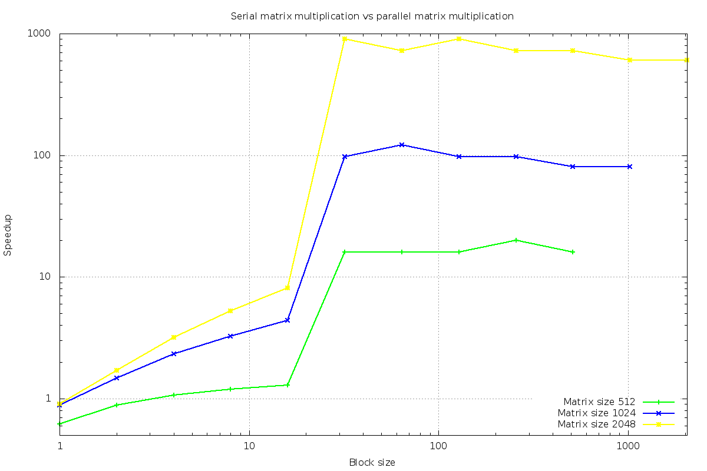

# Implementation of the Parallel distributed matrix matrix multiplication

## Serial version
***serial_multiplication.c ***:
```
// matrix per matrix serial multiplication
// on square matrices
#include <stdio.h>
#include <stdlib.h>
#include <time.h>

// #define SIZE 4096

// PRINT THE MATRIX M

void print_matrix(int rows, int cols, double *M) {
  int i, j;
  for (i = 0; i < rows; i++) {
    for (j = 0; j < cols; j++) {
      printf("%d ", (int)M[i * cols + j]);
    }
    printf("\n");
  }
}

int main(int argc, char *argv[]) {
  double *A, *B, *C;
  int i, h, k, z;
  int SIZE = atoi(argv[1]);

  // Allocate distributed matrices

  A = (double *)malloc(SIZE * SIZE * sizeof(double));
  B = (double *)malloc(SIZE * SIZE * sizeof(double));
  C = (double *)malloc(SIZE * SIZE * sizeof(double));

  // Initialize matrices

  // srand(time(NULL));

  for (i = 0; i < SIZE * SIZE; i++) {
    A[i] = i;  //(rand() % 1000 + 1);
    B[i] = i;  //(rand() % 1000 + 1);
    C[i] = 0;
  }

  // Calculate C
  for (h = 0; h < SIZE; ++h) {
    for (k = 0; k < SIZE; ++k) {
      for (z = 0; z < SIZE; ++z) {
        C[h * SIZE + z] += A[h * SIZE + k] * B[k * SIZE + z];
      }
    }
  }

  print_matrix(SIZE, SIZE, C);

  free(A);
  free(B);
  free(C);

  return 0;
}

```


## Parallel version
The Exercise is divided in 5 main points: 1) Distribute the Matrix, 2) Initialize the Distributed Matrix, 3) At every time step use MPI_Allgather to send at all processes a block of column of B, 4) Repeat point 3 for all blocks of column of B and 5) Sequential Print of the Matrix C with all processes sending data to P0.

`send_buf` is a square block of B, while `recv_buf` is the column of B made by the single square blocks from each process.

`MPI_Allgather` performs *gather* on the square blocks and *broadcast* on the columns of B.

***parallel_multiplication.c ***:
```
// mpi matrix per matrix multiplication using Allgather
// on square matrices

#include <mpi.h>
#include <stdio.h>
#include <stdlib.h>

// #define SIZE 16
#define MPI_TAG 10

// INITIALIZE THE BUFFER

void set_send_buf(int loc_size, int size, double *B, int current_proc,
                  double *send_buf) {
  int i, j;
  int start = loc_size * current_proc;
  for (i = 0; i < loc_size; i++) {
    for (j = 0; j < loc_size; j++) {
      send_buf[i * loc_size + j] = B[i * size + j + start];
    }
  }
}

// PRINT A MATRIX BLOCK M

void print_block(int rows, int cols, double *M) {
  int i, j;
  for (i = 0; i < rows; i++) {
    for (j = 0; j < cols; j++) {
      printf("%d ", (int)M[i * cols + j]);
    }
    printf("\n");
  }
  printf("------------------\n");
}

int main(int argc, char *argv[]) {
  int nprocs, rank;
  double *A, *B, *C;
  int i, loc_size, count;
  int SIZE = atoi(argv[1]);
  // FILE * fp;

  // Buffers for communication

  double *send_buf;
  double *recv_buf;

  MPI_Init(&argc, &argv);
  MPI_Comm_size(MPI_COMM_WORLD, &nprocs);
  MPI_Comm_rank(MPI_COMM_WORLD, &rank);

  loc_size = SIZE / nprocs;

  // Allocate distributed matrices

  A = (double *)malloc(loc_size * SIZE * sizeof(double));
  B = (double *)malloc(loc_size * SIZE * sizeof(double));
  C = (double *)malloc(loc_size * SIZE * sizeof(double));

  // recv_buf is the vertical sub-block of B

  send_buf = (double *)malloc(loc_size * loc_size * sizeof(double));
  recv_buf = (double *)malloc(loc_size * SIZE * sizeof(double));

  // Initialize matrices

  for (i = 0; i < loc_size * SIZE; i++) {
    A[i] = i;  // rand() % 1000 + 1 );
    B[i] = i;  // rand() % 1000 + 1 );
    C[i] = 0;
  }

  for (count = 0; count < nprocs; count++) {
    // Set the buffer from columns of B
    set_send_buf(loc_size, SIZE, B, count, send_buf);

    // Gathers
    MPI_Allgather(send_buf, loc_size * loc_size, MPI_DOUBLE, recv_buf,
                  loc_size * loc_size, MPI_DOUBLE, MPI_COMM_WORLD);

    int start = loc_size * count;
    int h, k, z;
    // Set C from its blocks
    for (h = 0; h < loc_size; ++h) {
      for (k = 0; k < SIZE; ++k) {  // this is the common size
        for (z = 0; z < loc_size; ++z) {
          C[h * SIZE + start + z] +=
              A[h * SIZE + k] * recv_buf[k * loc_size + z];
        }
      }
    }
  }

  // Sequentially print the resulting matrix

  // rank 0 prints the results
  if (rank == 0) {
    print_block(loc_size, SIZE, C);
    for (count = 1; count < nprocs; count++) {
      MPI_Recv(C, loc_size * SIZE, MPI_DOUBLE, count, MPI_TAG, MPI_COMM_WORLD,
               MPI_STATUS_IGNORE);
      print_block(loc_size, SIZE, C);
    }
  } else {
    // the other procs send their results to proc 0
    MPI_Send(C, loc_size * SIZE, MPI_DOUBLE, 0, MPI_TAG, MPI_COMM_WORLD);
  }

  // if( myrank == 0 ){
  //   FILE * fp;
  //   fp = fopen ("myfile.dat", "w");
  //   fwrite( A, sizeof(double), loc_size * SIZE, fp );
  //   for( count = 1; count < NPES; count ++){
  //       MPI_Recv( A, loc_size * SIZE, MPI_DOUBLE, count, 100, MPI_COMM_WORLD,
  //       MPI_STATUS_IGNORE );
  //       fwrite( A, sizeof(double), loc_size * SIZE, fp );
  //   }
  //   fclose(fp);
  // } else MPI_Send( A, loc_size * SIZE, MPI_DOUBLE, 0, 100, MPI_COMM_WORLD );

  free(A);
  free(B);
  free(C);
  free(send_buf);
  free(recv_buf);

  MPI_Finalize();

  return 0;
}

```




