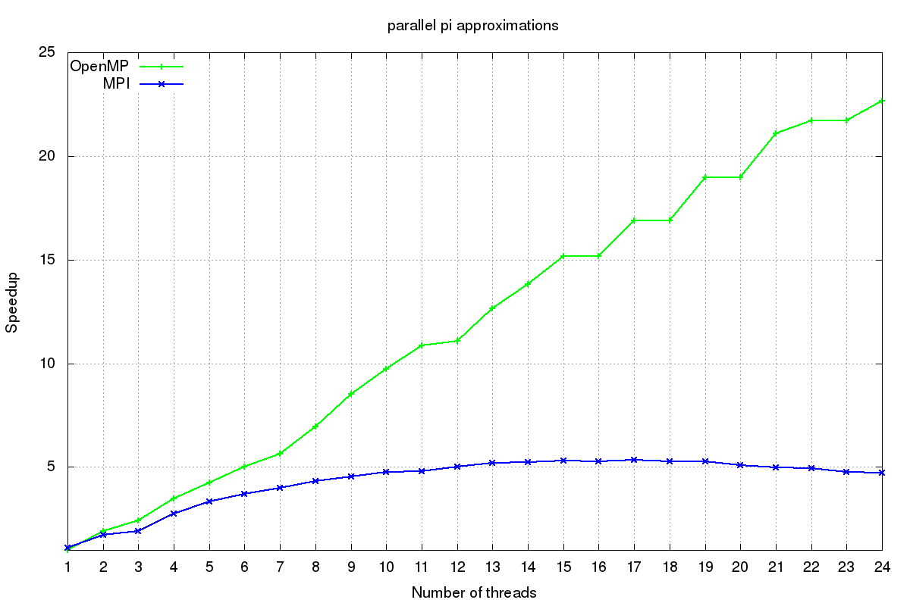

#  Parallel implementation of $\pi$ approximation

According to Amdhal's law the speedup in latency (which is the delay due to message passing between processes) is limited by the serial part of the problem and communication. This law is used in parallel computing in order to predict the theoretical speedup when using multiple processors. The law precisely states the relation

$$
S(n)=\frac{1}{(1-p)+p/n}
$$

where 
* S is the theoretical speedup of the execution of the whole task;
* n is the number of processes;
* p is the proportion of execution time that can be parallelized using n processes, while (1-p) is the non parallelizable part.

This report shows two parallelized versions of the code, using different communication protocols.

## Serial code provided
***ser_pi.c ***:
```
#include <stdio.h>

int main(){

  long n , i ; 
  double  w,x,sum,pi,f,a;

  n = 100000000;
  w = 1.0/n;
  sum = 0.0;

  for ( i = 1 ; i <= n ; i++ ) {
    x = w * (i - 0.5);
    sum = sum + (4.0 / (1.0 + x * x ) );
  } 

  pi = w * sum ;
  printf("Value of pi: %.16g\n", pi);

  return 0;
} 
```


## Parallel version using MPI communication protocol

MPI stands for "Message passing interface" and is based on the use of *distributed memory*: each process has access only to its portion of memory and all processes perform the same operation in parallel. 

In ***mpi_pi.c *** the *MPI_Reduce* operator allows to collect sums from each process, do a collective sum and then store the result in process 0, which is the one printing the correct result.

```
#include <mpi.h>
#include <stdio.h>

int main(int argc, char* argv[]) {
  int nprocs, rank;
  long n, i, size;
  double w, x, sum, pi;
  double f, start;

  MPI_Init(&argc, &argv);
  MPI_Comm_size(MPI_COMM_WORLD, &nprocs);  // number of processes
  MPI_Comm_rank(MPI_COMM_WORLD, &rank);    // labels for the processes

  n = 100000000;  // number of sub-intervals for each process

  size = n / nprocs;
  sum = 0.0;
  f = 1.0 / size;    // I assing one interval to each process, so each one
                     // operates inside an interval of width f
  start = f * rank;  // start is the starting point of the interval relative to
                     // the corresponding process
  w = f / n;         // width of a sub-interval

  for (i = 1; i <= size; i++) {
    x = start + w * (i - 0.5);          // mid point of interval i
    sum = sum + (4.0 / (1.0 + x * x));  // height f(x)
  }

  sum = sum * w;  // area = (sum f(x))*w

  MPI_Reduce(&sum, &pi, 1, MPI_DOUBLE, MPI_SUM, 0, MPI_COMM_WORLD);
  // 1 is the number of arguments
  // 0 is the rank of the process containing the result

  if (rank == 0)  // this only prints the significant value
    printf("Value of pi: %.16g\n", pi);

  MPI_Finalize();

  return 0;
}

```


## Parallel version using OpenMP communication protocol

OpenMP is made for *shared memory* devices, like multi-core processors and multi-socket nodes. In this case the `reduction(+ : sum)` clause makes each thread work on a copy of the variable `sum`. At the end of the for loop all local copies are reduced into a single global copy through sum operation. `x` has to be private in order to avoid overwriting from other threads, while loop index `i` is automatically considered private.

***openmp_pi.c ***:
```
#include <omp.h>
#include <stdio.h>

int main() {
  long n, i;
  double w, x, sum, pi;

  n = 100000000;
  w = 1.0 / n;
  sum = 0.0;

#pragma omp parallel for private(x) reduction(+ : sum)
  for (i = 1; i <= n; i++) {
    x = w * (i - 0.5);
    sum += (4.0 / (1.0 + x * x));
  }

  pi = w * sum;
  printf("Value of pi: %.16g, ", pi);

  return 0;
}

```


