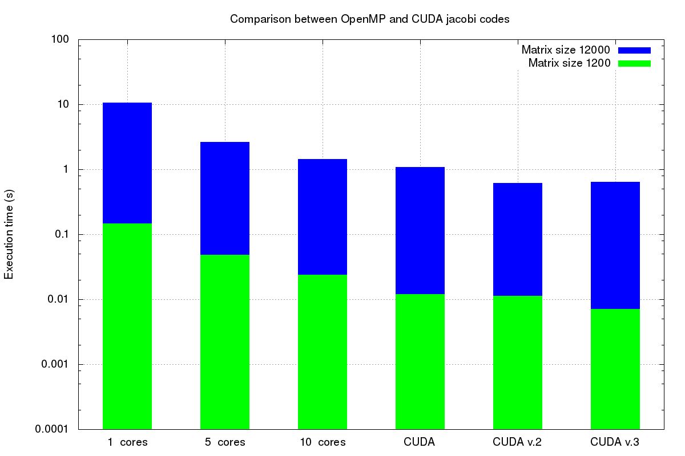

# CPU vs GPU performances
Starting from the serial code **jacobi.c** I implemented two parallel versions using OpenMP and CUDA application programming interfaces.

## Openmp

OpenMP is used to obtain parallelism in shared memory architectures, like within one multi-core CPU. This allows to divide the entire work into multiple independent instructions performed by different lightweight processes called *threads*.
In my code **openmp_jacobi.c** I used `omp_set_num_threads()` to set the number of threads and `#pragma omp parallel for` to split up loop iterations among threads. This command gives each thread a unique copy of the variables used inside the current loop.
I also used the `private` clause for index variables, in order to avoid overwritings between threads.

```
int main(int argc, char *argv[]) {
  
  ...

  // fill initial values
  omp_set_num_threads(nthreads);

// i and j will be private for each thread
#pragma omp parallel for private(i, j)
  for (i = 1; i <= dimension; ++i) {
    for (j = 1; j <= dimension; ++j) {
      matrix[(i * (dimension + 2)) + j] = 0.5;
    }
  }

  // set up borders
  increment = 100.0 / (dimension + 1);

#pragma omp parallel for private(i)
  for (i = 1; i <= dimension + 1; ++i) {
    matrix[i * (dimension + 2)] = i * increment;
    matrix[((dimension + 1) * (dimension + 2)) + (dimension + 1 - i)] =
        i * increment;
    matrix_new[i * (dimension + 2)] = i * increment;
    matrix_new[((dimension + 1) * (dimension + 2)) + (dimension + 1 - i)] =
        i * increment;
  }

  // start algorithm
  t_start = seconds();
  for (it = 0; it < iterations; ++it) {
    evolve(matrix, matrix_new, dimension);

    // swap the pointers
    tmp_matrix = matrix;
    matrix = matrix_new;
    matrix_new = tmp_matrix;
  }
	
	...

}

// ===============================================================
// FUNCTION DEFINITIONS

void evolve(double *matrix, double *matrix_new, size_t dimension) {
  size_t i, j;
// This will be a row dominant program.
#pragma omp parallel for private(i, j)
  for (i = 1; i <= dimension; ++i) {
    for (j = 1; j <= dimension; ++j) {
      matrix_new[(i * (dimension + 2)) + j] =
          (0.25) * (matrix[((i - 1) * (dimension + 2)) + j] +
                    matrix[(i * (dimension + 2)) + (j + 1)] +
                    matrix[((i + 1) * (dimension + 2)) + j] +
                    matrix[(i * (dimension + 2)) + (j - 1)]);
    }
  }
}

...

```

## CUDA

CUDA is used to perform parallelism using the GPU, named *device*, and is based on its communication with the CPU, named *host*. The parallel region in **cuda_jacobi.cu** is identified by the *kernel function* call 
`  jacobi<<< ((dimension+2) * (dimension+2))/NUM_THREADS, NUM_THREADS >>>(iterations, dimension, d_matrix, d_matrix_new);
`
which is called by host and executed by device.

Here I proposed three versions of the codes parallelized with CUDA:
* v.1 ***cuda_jacobi.c*** initializes the matrices in host memory and performs Jacobi in device memory

```
...

__global__ void jacobi(int iterations, int dimension, double * d_matrix, double * d_matrix_new)
{
  double * tmp_matrix; 
  int idx = ( blockIdx.x * blockDim.x ) + threadIdx.x; // local index for each thread

  // global indexes for the matrices (idx = i*dimension+j)
  int i = idx / dimension; 
  int j = idx % dimension; 
  
  if( i > 0 && i < (dimension+1) && j > 0 && j < (dimension+2)){
  // if ( (idx < (dimension + 2) * (dimension + 2)) && i > 0 && j > 0){
    for(int it = 0; it < iterations; ++it ){
      // This is a row dominant program.
      d_matrix_new[ ( i * ( dimension + 2 ) ) + j ] = ( 0.25 ) * 
      ( d_matrix[ ( ( i - 1 ) * ( dimension + 2 ) ) + j ] + 
      d_matrix[ ( i * ( dimension + 2 ) ) + ( j + 1 ) ] +     
      d_matrix[ ( ( i + 1 ) * ( dimension + 2 ) ) + j ] + 
      d_matrix[ ( i * ( dimension + 2 ) ) + ( j - 1 ) ] ); 

      // swap the pointers
      tmp_matrix = d_matrix;
      d_matrix = d_matrix_new;
      d_matrix_new = tmp_matrix;

      __syncthreads();
    }
  }
}

// ===============================================================================
  
int main(int argc, char* argv[]){

  ...

  byte_dimension = sizeof(double*) * ( dimension + 2 ) * ( dimension + 2 );
  
  h_matrix = ( double* )malloc( byte_dimension );
  h_matrix_new = ( double* )malloc( byte_dimension );

  cudaMalloc( (void **) &d_matrix, byte_dimension); // allocates memory on the GPU
  cudaMalloc( (void **) &d_matrix_new, byte_dimension);

  memset( h_matrix, 0, byte_dimension ); // sets initial values to zero
  memset( h_matrix_new, 0, byte_dimension );

  //fill initial values  
  for( i = 1; i <= dimension; ++i ){
    for( j = 1; j <= dimension; ++j ){
      h_matrix[ ( i * ( dimension + 2 ) ) + j ] = 0.5;
    }
  }
        
  // set up borders 
  increment = 100.0 / ( dimension + 1 );
  
  for( i=1; i <= dimension+1; ++i ){
    h_matrix[ i * ( dimension + 2 ) ] = i * increment; //setting left border
    h_matrix[ ( ( dimension + 1 ) * ( dimension + 2 ) ) + ( dimension + 1 - i ) ] = i * increment; //setting bottom border
    h_matrix_new[ i * ( dimension + 2 ) ] = i * increment;
    h_matrix_new[ ( ( dimension + 1 ) * ( dimension + 2 ) ) + ( dimension + 1 - i ) ] = i * increment;
  }

#ifdef DEBUG
  print_matrix(dimension+2, dimension+2, h_matrix);
#endif
  
  t_start = seconds();

  // copy from cpu to gpu
  cudaMemcpy( d_matrix, h_matrix, byte_dimension, cudaMemcpyHostToDevice );
  cudaMemcpy( d_matrix_new, h_matrix_new, byte_dimension, cudaMemcpyHostToDevice );

  // start algorithm
  jacobi<<< ((dimension+2) * (dimension+2))/NUM_THREADS, NUM_THREADS >>>(iterations, dimension, d_matrix, d_matrix_new);

  // copy from gpu to cpu
  cudaMemcpy( h_matrix, d_matrix, byte_dimension, cudaMemcpyDeviceToHost );
  // cudaMemcpy( h_matrix_new, d_matrix_new, byte_dimension, cudaMemcpyDeviceToHost );
 
  t_end = seconds();

	...

}

...

```

* v.2 ***cuda_jacobi_init.c*** both initializes and performs Jacobi in device memory

```
...

__global__ void matrix_init(int iterations, int dimension, double * d_matrix, double * d_matrix_new)
{
  int idx = ( blockIdx.x * blockDim.x ) + threadIdx.x; // local index for each thread

  // global indexes for the matrices (idx = i*dimension+j)
  int i = idx / dimension; 
  int j = idx % dimension; 

  double increment; 

  //fill initial values  
  for( i = 1; i <= dimension; ++i ){
    for( j = 1; j <= dimension; ++j ){
      d_matrix[ ( i * ( dimension + 2 ) ) + j ] = 0.5;
    }
  }

  __syncthreads();
        
  // set up borders 
  increment = 100.0 / ( dimension + 1 );
  
  for( i=1; i <= dimension+1; ++i ){
    d_matrix[ i * ( dimension + 2 ) ] = i * increment; //setting left border
    d_matrix[ ( ( dimension + 1 ) * ( dimension + 2 ) ) + ( dimension + 1 - i ) ] = i * increment; //setting bottom border
    d_matrix_new[ i * ( dimension + 2 ) ] = i * increment;
    d_matrix_new[ ( ( dimension + 1 ) * ( dimension + 2 ) ) + ( dimension + 1 - i ) ] = i * increment;
  }

  __syncthreads();

}

__global__ void jacobi(int iterations, int dimension, double * d_matrix, double * d_matrix_new)
{
  double * tmp_matrix; 
  int idx = ( blockIdx.x * blockDim.x ) + threadIdx.x; // local index for each thread

  // global indexes for the matrices (idx = i*dimension+j)
  int i = idx / dimension; 
  int j = idx % dimension; 

  if( i > 0 && i < (dimension+1) && j > 0 && j < (dimension+2)){
  // if ( (idx < (dimension + 2) * (dimension + 2)) && i > 0 && j > 0){
    for(int it = 0; it < iterations; ++it ){
      // This is a row dominant program.
      d_matrix_new[ ( i * ( dimension + 2 ) ) + j ] = ( 0.25 ) * 
      ( d_matrix[ ( ( i - 1 ) * ( dimension + 2 ) ) + j ] + 
      d_matrix[ ( i * ( dimension + 2 ) ) + ( j + 1 ) ] +     
      d_matrix[ ( ( i + 1 ) * ( dimension + 2 ) ) + j ] + 
      d_matrix[ ( i * ( dimension + 2 ) ) + ( j - 1 ) ] ); 

      // swap the pointers
      tmp_matrix = d_matrix;
      d_matrix = d_matrix_new;
      d_matrix_new = tmp_matrix;

      __syncthreads(); 
    }
  }
}
  
// ===============================================================================

int main(int argc, char* argv[]){

  ...

  byte_dimension = sizeof(double*) * ( dimension + 2 ) * ( dimension + 2 );
  
  h_matrix = ( double* )malloc( byte_dimension );
  // h_matrix_new = ( double* )malloc( byte_dimension );

  cudaMalloc( (void **) &d_matrix, byte_dimension); // allocates memory on the GPU
  cudaMalloc( (void **) &d_matrix_new, byte_dimension);

  // memset( h_matrix, 0, byte_dimension ); // sets initial values to zero
  // memset( h_matrix_new, 0, byte_dimension );
  
  t_start = seconds();

  // call kernel functions
  matrix_init<<< ((dimension+2) * (dimension+2))/NUM_THREADS, NUM_THREADS >>>(iterations, dimension, d_matrix, d_matrix_new);
  jacobi<<< ((dimension+2) * (dimension+2))/NUM_THREADS, NUM_THREADS >>>(iterations, dimension, d_matrix, d_matrix_new);

  // copy from gpu to cpu
  cudaMemcpy( h_matrix, d_matrix, byte_dimension, cudaMemcpyDeviceToHost );
 
  t_end = seconds();

	...
}
...

```

* v.3 ***cuda_jacobi_shared.c*** also uses shared memory inside the kernel function *jacobi*

```
...

__global__ void matrix_init(int iterations, int dimension, double * d_matrix, double * d_matrix_new)
{
  int idx = ( blockIdx.x * blockDim.x ) + threadIdx.x; // local index for each thread

  // global indexes for the matrices (idx = i*dimension+j)
  int i = idx / dimension; 
  int j = idx % dimension; 

  double increment; 

  //fill initial values  
  for( i = 1; i <= dimension; ++i ){
    for( j = 1; j <= dimension; ++j ){
      d_matrix[ ( i * ( dimension + 2 ) ) + j ] = 0.5;
    }
  }

  __syncthreads();
        
  // set up borders 
  increment = 100.0 / ( dimension + 1 );
  
  for( i=1; i <= dimension+1; ++i ){
    d_matrix[ i * ( dimension + 2 ) ] = i * increment; //setting left border
    d_matrix[ ( ( dimension + 1 ) * ( dimension + 2 ) ) + ( dimension + 1 - i ) ] = i * increment; //setting bottom border
    d_matrix_new[ i * ( dimension + 2 ) ] = i * increment;
    d_matrix_new[ ( ( dimension + 1 ) * ( dimension + 2 ) ) + ( dimension + 1 - i ) ] = i * increment;
  }

  __syncthreads();

}

// jacobi method

extern __shared__ double * ptr[]; 
__global__ void jacobi(int iterations, int dimension, double * d_matrix, double * d_matrix_new)
{
  double * tmp_matrix; 
  
  size_t byte_dimension = sizeof(double*) * ( dimension + 2 ) * ( dimension + 2 );
  double * s_matrix = (double*)&ptr[byte_dimension];
  s_matrix = d_matrix;

  int idx = ( blockIdx.x * blockDim.x ) + threadIdx.x; // local index for each thread

  // global indexes for the matrices (idx = i*dimension+j)
  int i = idx / dimension; 
  int j = idx % dimension; 

  if( i > 0 && i < (dimension+1) && j > 0 && j < (dimension+2)){
  // if ( (idx < (dimension + 2) * (dimension + 2)) && i > 0 && j > 0){
    for(int it = 0; it < iterations; ++it ){
      // This is a row dominant program.
      d_matrix_new[ ( i * ( dimension + 2 ) ) + j ] = ( 0.25 ) * 
      ( s_matrix[ ( ( i - 1 ) * ( dimension + 2 ) ) + j ] + 
      s_matrix[ ( i * ( dimension + 2 ) ) + ( j + 1 ) ] +     
      s_matrix[ ( ( i + 1 ) * ( dimension + 2 ) ) + j ] + 
      s_matrix[ ( i * ( dimension + 2 ) ) + ( j - 1 ) ] ); 

      // swap the pointers
      tmp_matrix = s_matrix;
      s_matrix = d_matrix_new;
      d_matrix_new = tmp_matrix;

      __syncthreads(); 
    }
    d_matrix = s_matrix;
  }
}
  
// ===============================================================================

int main(int argc, char* argv[]){

  ...

  byte_dimension = sizeof(double*) * ( dimension + 2 ) * ( dimension + 2 );
  
  h_matrix = ( double* )malloc( byte_dimension );
  // h_matrix_new = ( double* )malloc( byte_dimension );

  cudaMalloc( (void **) &d_matrix, byte_dimension); // allocates memory on the GPU
  cudaMalloc( (void **) &d_matrix_new, byte_dimension);

  // memset( h_matrix, 0, byte_dimension ); // sets initial values to zero
  // memset( h_matrix_new, 0, byte_dimension );
  
  t_start = seconds();

  // call kernel functions
  matrix_init<<< ((dimension+2) * (dimension+2))/NUM_THREADS, NUM_THREADS >>>(iterations, dimension, d_matrix, d_matrix_new);
  jacobi<<< ((dimension+2) * (dimension+2))/NUM_THREADS, NUM_THREADS >>>(iterations, dimension, d_matrix, d_matrix_new);

  // copy from gpu to cpu
  cudaMemcpy( h_matrix, d_matrix, byte_dimension, cudaMemcpyDeviceToHost );
 
  t_end = seconds();

	...
}
...

```

## Comparison

These are the results in the execution time obtained using Cosilt cluster on matrices of size 1200 and 12000.

